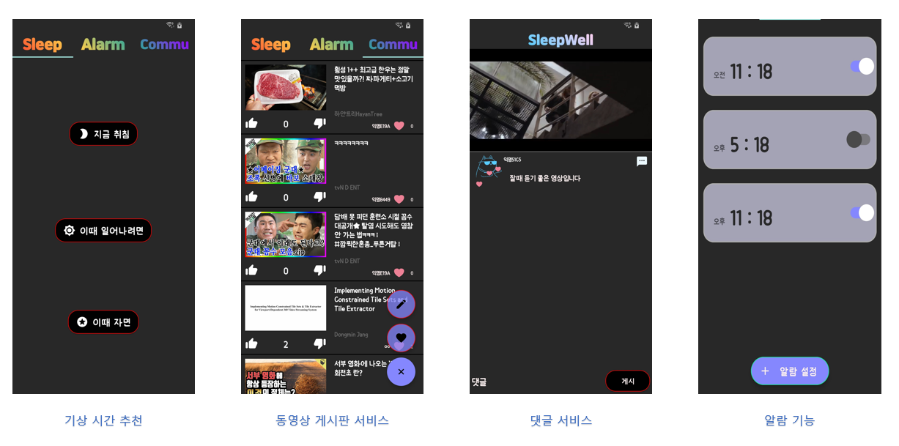

# Sleepwell for SpringBoot
Spring Boot with NodeJS and MYSQL
## Introduction
수면을 효율적으로 하기 위해 제작된 간편한 앱으로서, 현재 자는 시간을 기준으로 최적의 기상 시간을 알려줍니다. 그리고, 알람설정과 수면유도를 위한 동영상 시청 서비스를 제공하고 있습니다.



### 설치

--- 

이 링크를 통해 들어가서 다운을 받아주세요

[https://play.google.com/store/apps/details?id=practice.kotlin.com.sleepwell](https://play.google.com/store/apps/details?id=practice.kotlin.com.sleepwell)

### ArchiTecture

---
 


### Version

---

|Project Environment|Version|
|:---:|:---:|
|`Spring Boot`|2.2.6|
|`MYSQL`|8.0|
|`maven` |3.6.3|

### Must Be Set in Advance when Deploying Spring Boot Server

---

if you want to build and run successfully sotact-backend Spring Boot Server, must be set MYSQL_URL and MYSQL_USERNAME and MYSQL_ROOT_PASSWORD variables. these variables in spring/src/main/resources/application.properties

but if you didn't install git and maven before, please install these follow executions  

For Ubuntu: install git and maven   
(It is a Standard for Ubuntu 20.04, package manager : **apt**)

```bash
sudo apt-get install git
sudo apt-get install maven
```

For CentOS : install git and maven    
(It is a Standard for CentOS 8.2, package manager : **yum**)
```bash
sudo yum install git
sudo yum install maven

sudo yum -y install @mysql (mysql 최신버전 기준)
mysql -u root -p (id is root)
ALTER USER 'root'@'localhost' IDENTIFIED BY '원하는 password';

```

For Mac OS : install git and maven 

```bash
brew install git
brew install maven
```

### For Deploy

---

if you want to build and run sotact-backend Spring Boot Server, clone our gitlab repository and move sotact-backend directory and then checkout develop branch 

```bash
git clone https://github.com/goodgood619/goodsleepwell.git
cd goodsleepwell
mvn package -Dmaven.test.skip=true
cd target
java -jar *.jar
```

**default port is 8080**

### DataBase Diagram

---


### goodsleepwell Contributors

---

이재석 : krgeo@naver.com

이윤석 : gktgnjftm@naver.com

